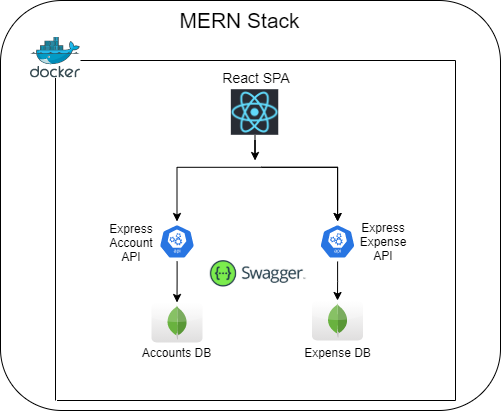

# ExpenseWeb

## Application Overview:



The application allows users to manage their daily expenses, you can get registered in the application and add your daily expenses, it will store your expense details.   

## Prerequisite
Download and install [Docker Desktop](https://www.docker.com/products/docker-desktop) based on your operating system.

## Project build
You can build the project in docker container by running `docker-compose up -d` in the root directory.
Each Dockerfile in the repo will be built, which will be named as `expenseweb_<container>`.
#### *Webui*
navigate to `http://localhost:3000`
#### *Backend*
ExpenseApi: `http://localhost:3001`   
AccountApi: `http://localhost:3002`
#### *Swagger*
navigate to `http://localhost:8080`
#### *Existing user*   
`username`: testauto@gmail.com  
`password`: Password1   
#### *Other commands (optional)*
```sh
# To stop the project
docker-compose stop
# To stop the project and remove containers
docker-compose down
# To stop and remove project containers and images
docker-compose down --rmi all
```

### Problem running in docker?
follow the below steps to run the applications locally.
install [Nodejs](https://nodejs.org/en/)
```sh
cd apis/AccountApi && npm i && npm start
cd apis/ExpenseApi && npm i && npm start
npm i && npm start
```